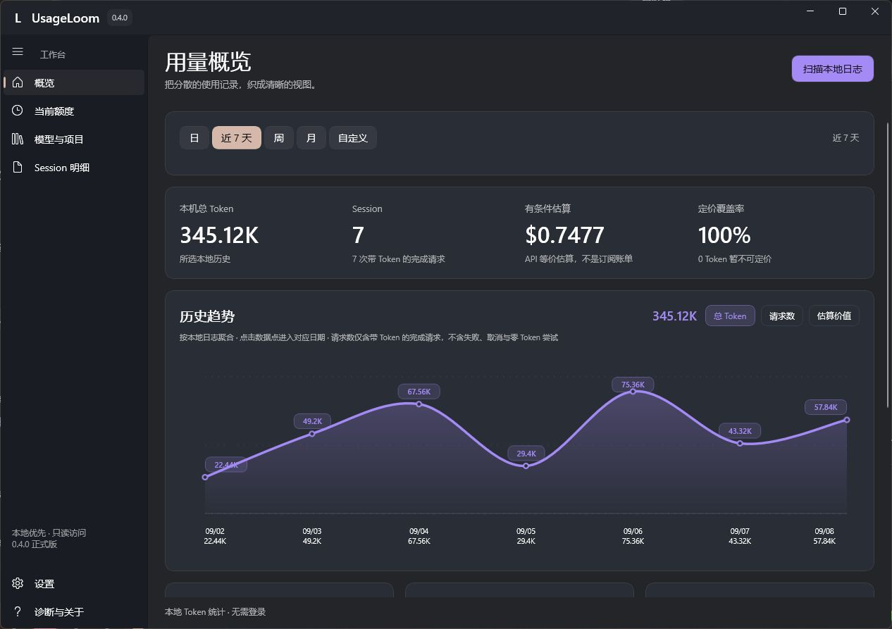
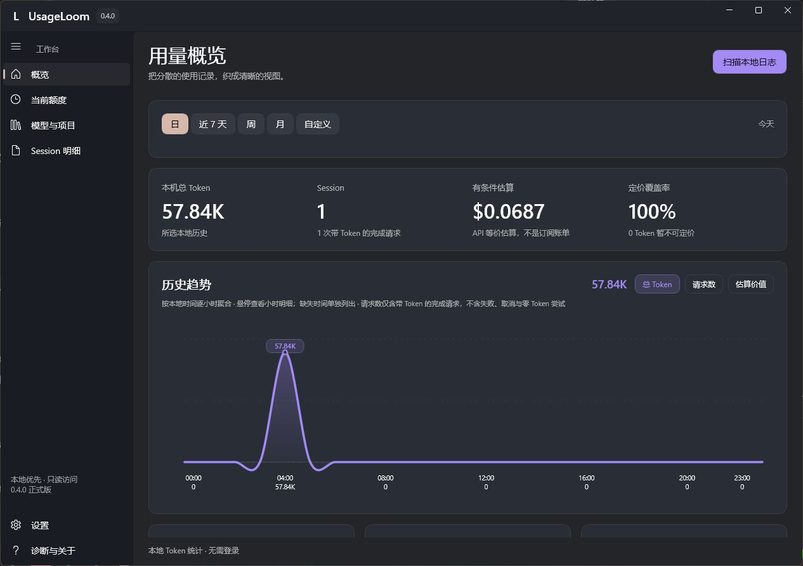
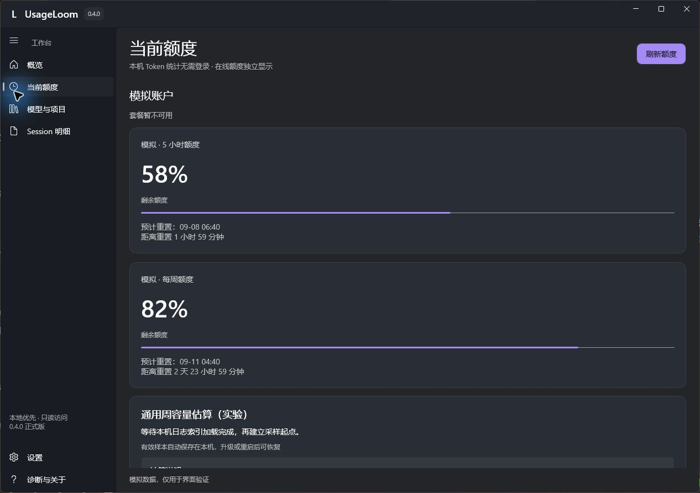
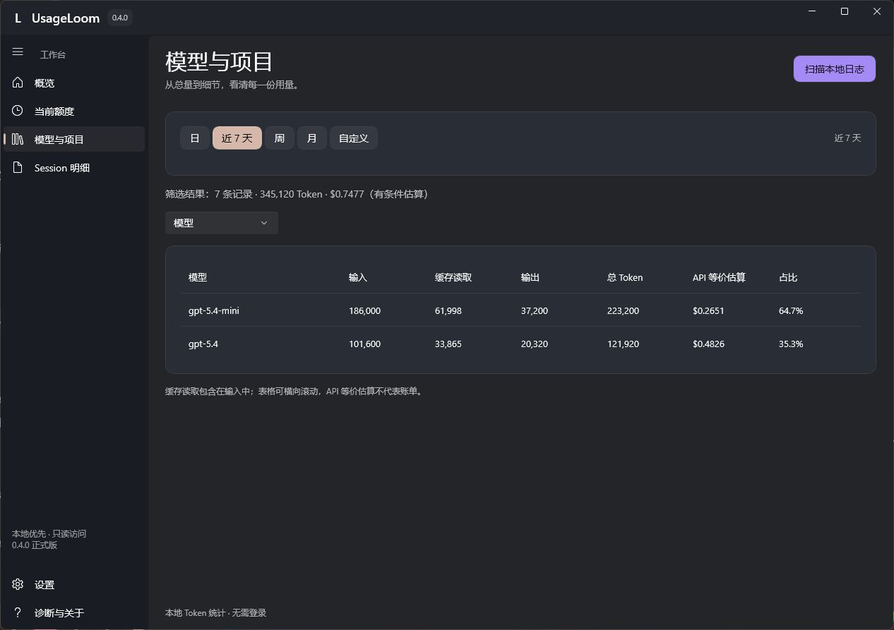
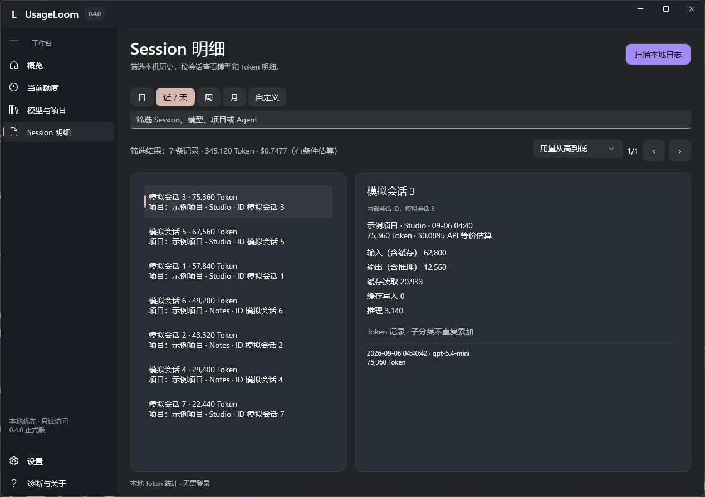
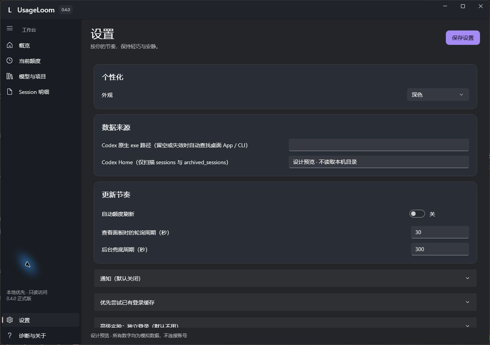

# UsageLoom

Windows 11 上的 Codex 用量与额度面板。无需登录即可统计本机 Token；通过官方后端查询已有缓存账号的在线额度。

[下载 MSI 与 ZIP](https://github.com/cynicism66/UsageLoom/releases/latest) · [安装说明](docs/INSTALLATION.md) · [问题反馈](https://github.com/cynicism66/UsageLoom/issues)

UsageLoom 是独立开源项目，不隶属于 OpenAI。本地统计与费用估算由 UsageLoom 计算。

## Windows 桌面版 0.6.4

- 用量概览：Token、完成请求、API 等价费用与定价覆盖率；日视图按小时，较长范围按日期展示趋势。
- 本地分析：按模型、项目和 Session 查看输入、缓存、输出及推理计数，支持日期筛选与明细。
- 账号额度：展示服务端返回的通用窗口、剩余比例、重置时间、套餐与可用重置次数；Spark 专属额度单独显示。
- 归属区分：本机全部记录、当前账号观察归属、未归属或其他账号分别列出，不将旧记录自动算给当前账号。
- 托盘速览：K/M/B 紧凑数字、今日用量、额度摘要与刷新；可置顶，置顶时点击其他窗口不会自动隐藏。
- 个性化：设置分组可展开，支持跟随系统、浅色和深色，选择后立即应用并保存；简体中文和 English 自动保存，退出并重新打开后生效。
- 外观与提醒：小型套餐标识、应用图标；额度不足和即将重置通知分别开启，默认关闭。
- 本地缓存：SQLite 索引与周容量采样持久化，MSI 和 ZIP 共用用户数据目录。有效估算独立归档，可从“设置 → 每周容量估算 → 估算历史”查看；重置当前采样不会删除历史。周美元估算显示在额度百分比旁。
- 后台采样：开启自动刷新并保持托盘运行时，有新增用量默认每 30 秒查询额度，空闲后恢复兜底周期；不必打开面板。自定义单日趋势按小时展示。

### 本版更新与升级

- **周容量估算 v4**：至少累计 3 个百分点组成一段，等待至少 2 分钟后的额度快照和日志索引确认，按累计费用 / 累计配对百分点计算。至少两段有效样本后显示当前结果，减少 1% 跳变和日志延迟的影响；不保证波动消失。
- **参考范围仅在设置展示**：至少三个已定价区间后显示各区间估值的最小–最大范围，并展示样本成熟度。额度卡片和托盘继续显示单个估算值；范围不是官方额度或统计置信区间。
- **旧估算保留**：旧算法最终结果独立归档，新算法样本不足时仍可作为带日期的历史参考，不混入新算法样本。

此前版本的改进仍然保留：

- **修复继承历史重复计数**：父会话标记只处理一次；结合明确父子关系、连续计数字段和时间顺序识别复制的历史前缀，不按相同数值跨会话去重。
- **旧数据自动迁移**：解析索引升至 v7，首次扫描验证原始日志、备份数据库后重建。迁移可能使此前虚增的 Token、请求数和 API 等价估值下降；请勿删除数据目录，也不要用旧版重新扫描。
- **窄窗口图表**：历史趋势标题、指标和说明分行排布，修复重叠；增加中英文宽窄切换布局检查。
- **后台批量计算**：有新数据时每 5 分钟计算周容量，设置中可立即计算；计算与过期明细清理在后台串行执行，打开面板不触发重算。账号、套餐、设置或用量快照变化时丢弃旧的界面结果。
- **可见状态**：设置 → 每周容量估算显示等待原因、后台计算状态、上次计算时间和下次批量检查时间；计算失败保留已有估算。
- **归属确认入口**：概览选择日期范围 →“查看与确认 Token 归属”→ 选择日期并核对预览 → 勾选确认。只合并预览中有时间的未归属记录，其他账号不覆盖；执行前自动备份数据库，记录为用户确认，后续可配对区间统一重算。
- **明细保留策略**：每天检查一次，保留至少 30 天额度快照和配对明细，并保护完整周期边界；估算结果、Token 历史、归属记录及原始日志不自动删除。清理后的快照不能再追溯重算。
- **Windows 发布检查**：新增 .NET 核心与存储回归、桌面自包含构建及 MSI/ZIP 检查；工作流只生成验证产物，不会自动发布 GitHub Release。
- 周容量估算采用时间区间配对：保存额度查询时间、原始百分比、账号指纹、套餐及重置周期；迟到日志和用户确认补归属会重算对应区间，不重复累加。
- 额度重置或回升后，先显示带日期的上次有效估算，当前周期获得有效样本后替换。历史回显无需等待日志扫描完成。
- 同账号正常退出再启动时，符合边界的新增记录可标记为推定归属；推定不等于已证实，不能保证所有停机记录自动归属。
- 修复补归属记录格式导致的索引读取失败，保留已有数据；优化设置面板展开收起，提供中英文及即时外观切换。

升级前从托盘退出 UsageLoom，再安装新版 MSI 或解压 ZIP。两种版本默认共用 `%LOCALAPPDATA%\UsageLoom\user-data\`，请勿删除此目录。v2/v3 估算保留为历史参考，不混入 v4 样本；旧版未保存的额度快照无法补造。美元结果是实验性 API 等价估算，不是官方美元余额。

详细说明见 [0.6.4 发布说明](docs/RELEASE-0.6.4.md)。安装包尚未签名；自动化测试不代表干净 Windows 安装、多屏/DPI 或真实托盘人工验收。下方截图仍为明确标注的 0.4.0 演示截图。

## 实际界面

以下六张图于 2026-09-08 直接操作 **0.4.0 程序窗口**截取，不是设计稿，也不是用户提供的旧截图。使用内置演示模式，所有账号、会话和数值均为模拟数据，不代表真实套餐额度或价格承诺。

### 用量概览

先选择时间范围，再查看 Token、带 Token 的完成请求、API 等价费用及定价覆盖率。趋势指标可切换总 Token、请求数和估算价值；摘要数字采用 K/M/B。



### 日视图：按小时看消耗

选择“日”后按本地时间聚合到小时，不再只显示一个当天总量点。悬停查看小时明细；缺失时间的记录会单独说明。



### 当前额度

额度窗口展示剩余比例和重置时间，实际窗口数量以服务端响应为准。图中为模拟的五小时和每周窗口，并非所有套餐都同时拥有这两个窗口。下方的周容量估算独立采样，不能当作官方固定上限。



### 模型与项目

使用维度下拉框切换分析对象，对比输入、缓存读取、输出、总 Token、API 等价费用和占比。缓存读取已经包含在输入中，不应再次相加。



### Session 明细

按时间、会话、模型、项目或 Agent 筛选；左侧选择 Session，右侧查看计数分类与对应 Token 记录。截图里的名称都是示例会话，不包含真实任务正文。



### 设置

选择外观、本地日志位置和官方后端程序；分别调整查看面板时的轮询周期与后台兜底周期。额度不足、即将重置通知可单独开启，默认关闭。截图中的路径字段是演示占位文字，不是需要照填的目录。



## 安装和启动

要求 Windows 11 x64。发行包包含 .NET 和 Windows App SDK 运行库，无需另装开发环境。

1. 普通使用下载 MSI，安装向导支持选择目录、桌面和开始菜单快捷方式。
2. 免安装下载 ZIP，完整解压后运行 `UsageLoom.App.exe`，不要只复制 EXE。
3. 升级前从托盘退出旧版；不要同时运行多个版本。
4. 需要固定到任务栏时，在 Windows 中手动选择“固定到任务栏”。

数据统一保存在 `%LOCALAPPDATA%\UsageLoom\user-data\`，更换 ZIP 解压目录不会重置数据。卸载程序与删除个人数据是不同操作。详见[免安装版](docs/PORTABLE.md)、[本地数据](docs/LOCAL_DATA.md)。

发行文件目前没有商业代码签名。请核对本仓库 Release 来源及 SHA-256；遇到安全警告先核验文件，不要关闭系统安全保护。

## 在线额度与本地用量

本地 Token 统计不要求安装 CLI 或登录。在线额度需要可用的官方 Codex 后端和有效登录缓存，可在设置中选择后端程序。默认尝试本机已有缓存，不需要在 UsageLoom 重复登录；失败时本地统计仍可使用。也提供由官方后端处理的独立授权入口，见[授权说明](docs/AUTHORIZATION.md)。

缓存账号不一定就是另一个桌面窗口此刻使用的账号。观察归属只是同一本机账户指纹连续确认期间的新增记录，不是官方跨设备账号总用量。失败、取消、零 Token 请求及未保留日志不一定计入完成请求数。

## 周容量与费用估算（实验）

API 等价费用不是订阅账单、现金余额或官方固定周额度。周容量根据本机新增 Token/API 等价费用与周额度下降比例配对外推，受采样时差、模型组合、其他设备、其他共享额度功能和缺价影响。

当前仅使用当前账号的观察归属增量，并排除 Spark；升级后旧口径样本作废、重新采样。小样本、额度更新延迟、缺价和其他设备的消耗仍可能放大误差，结果仅供观察，不应拿来判断套餐是否兑现额度。不能将网传的 $500/$2000 写成固定上限。价格来源、日期、倍率和未知项见[定价说明](docs/PRICING.md)。

## 隐私

- 不上传本地日志，不含 UsageLoom 遥测或托管服务。
- 不直接读取 auth.json、Cookie、access token 或 refresh token；认证与联网由官方后端负责。
- 扫描会读取 JSONL 文件，但只提取允许的元数据和用量字段，不保存会话正文。
- 缺少稳定 ID 时，账号响应仅在内存参与本机 HMAC 指纹计算，不保存明文邮箱。
- 设置、索引、采样和脱敏运行日志保存在用户数据目录；不要把整个目录上传到问题反馈。

详见[隐私说明](docs/PRIVACY.md)和[安全政策](SECURITY.md)。

## 构建与验证

Windows 构建使用 .NET 10 SDK、WinUI 3 与 WiX 6：

```powershell
./scripts/build-windows.ps1 -Publish
./scripts/build-msi.ps1 -Version 0.4.5
./scripts/build-portable.ps1 -Version 0.4.5
./scripts/test-msi-package.ps1 -Version 0.4.0
```

核心回归：`dotnet run --project tests/UsageLoom.Core.Tests -c Release`。桌面冒烟：退出运行中的程序后执行 `./scripts/test-ui-startup.ps1 -AllPages`。后者不替代干净系统安装、多屏 DPI、托盘置顶的实际交互验收。

仓库保留 0.1.0 JavaScript/MCP 原型（`npm run check`），其包版本与 Windows 桌面版分开。索引目前按受影响 Session 重放，不宣称完整数据库级增量聚合。

## 致谢与许可

参考了 [codex-usage](https://github.com/zJay26/codex-usage)、[CodexBarWindows](https://github.com/Nirlep5252/CodexBarWindows) 和 [cockpit-tools](https://github.com/jlcodes99/cockpit-tools) 的产品思路。UsageLoom 独立实现，不代表这些项目的认可或参与。

[MIT License](LICENSE) · [第三方声明](THIRD_PARTY_NOTICES.md) · [项目缘起](docs/PROJECT_ORIGINS.md) · [变更记录](CHANGELOG.md) · [参与贡献](CONTRIBUTING.md)
