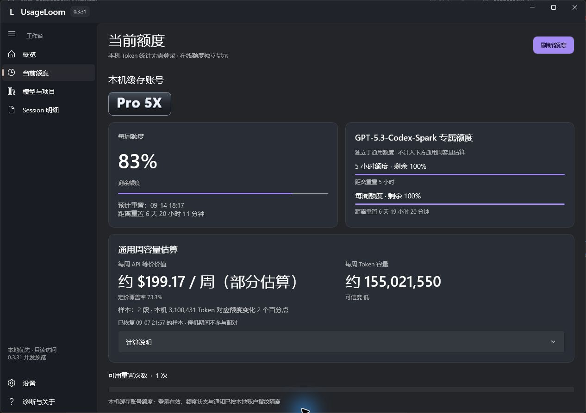
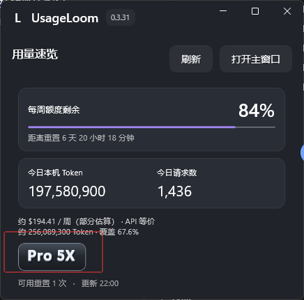

# UsageLoom

Windows 11 上的 Codex 用量与额度面板。无需登录即可统计本机 Token；通过官方后端查询已有缓存账号的在线额度。

[下载 MSI 与 ZIP](https://github.com/cynicism66/UsageLoom/releases/latest) · [安装说明](docs/INSTALLATION.md) · [问题反馈](https://github.com/cynicism66/UsageLoom/issues)

UsageLoom 是独立开源项目，不隶属于 OpenAI。本地统计与费用估算由 UsageLoom 计算。

## Windows 桌面版 0.4.0

- 用量概览：Token、完成请求、API 等价费用与定价覆盖率；日视图按小时，较长范围按日期展示趋势。
- 本地分析：按模型、项目和 Session 查看输入、缓存、输出及推理计数，支持日期筛选与明细。
- 账号额度：展示服务端返回的通用窗口、剩余比例、重置时间、套餐与可用重置次数；Spark 专属额度单独显示。
- 归属区分：本机全部记录、当前账号观察归属、未归属或其他账号分别列出，不将旧记录自动算给当前账号。
- 托盘速览：K/M/B 紧凑数字、今日用量、额度摘要与刷新；可置顶，置顶时点击其他窗口不会自动隐藏。
- 外观与提醒：深浅主题、小型套餐标识、应用图标；额度不足和即将重置通知分别开启，默认关闭。
- 本地缓存：SQLite 索引与周容量采样持久化，MSI 和 ZIP 共用用户数据目录。

## 实际界面

以下是本机运行截图（0.3.31 预发布版）；0.4.0 在此基础上缩小套餐标识、增加应用图标、紧凑数字与小窗置顶。





## 安装和启动

要求 Windows 11 x64。发行包包含 .NET 和 Windows App SDK 运行库，无需另装开发环境。

1. 普通使用下载 MSI，安装向导支持选择目录、桌面和开始菜单快捷方式。
2. 免安装下载 ZIP，完整解压后运行 `UsageLoom.App.exe`，不要只复制 EXE。
3. 升级前从托盘退出旧版；不要同时运行多个版本。
4. 需要固定到任务栏时，在 Windows 中手动选择“固定到任务栏”。

数据统一保存在 `%LOCALAPPDATA%\UsageLoom\user-data\`，更换 ZIP 解压目录不会重置数据。卸载程序与删除个人数据是不同操作。详见[免安装版](docs/PORTABLE.md)、[本地数据](docs/LOCAL_DATA.md)。

发行文件目前没有商业代码签名。请核对本仓库 Release 来源及 SHA-256；遇到安全警告先核验文件，不要关闭系统安全保护。

## 在线额度与本地用量

本地 Token 统计不要求安装 CLI 或登录。在线额度需要可用的官方 Codex 后端和有效登录缓存，可在设置中选择后端程序。默认尝试本机已有缓存，不需要在 UsageLoom 重复登录；失败时本地统计仍可使用。也提供由官方后端处理的独立授权入口，见[授权说明](docs/AUTHORIZATION.md)。

缓存账号不一定就是另一个桌面窗口此刻使用的账号。观察归属只是同一本机账户指纹连续确认期间的新增记录，不是官方跨设备账号总用量。失败、取消、零 Token 请求及未保留日志不一定计入完成请求数。

## 周容量与费用估算（实验）

API 等价费用不是订阅账单、现金余额或官方固定周额度。周容量根据本机新增 Token/API 等价费用与周额度下降比例配对外推，受采样时差、模型组合、其他设备、其他共享额度功能和缺价影响。

当前仅使用当前账号的观察归属增量，并排除 Spark；升级后旧口径样本作废、重新采样。小样本、额度更新延迟、缺价和其他设备的消耗仍可能放大误差，结果仅供观察，不应拿来判断套餐是否兑现额度。不能将网传的 $500/$2000 写成固定上限。价格来源、日期、倍率和未知项见[定价说明](docs/PRICING.md)。

## 隐私

- 不上传本地日志，不含 UsageLoom 遥测或托管服务。
- 不直接读取 auth.json、Cookie、access token 或 refresh token；认证与联网由官方后端负责。
- 扫描会读取 JSONL 文件，但只提取允许的元数据和用量字段，不保存会话正文。
- 缺少稳定 ID 时，账号响应仅在内存参与本机 HMAC 指纹计算，不保存明文邮箱。
- 设置、索引、采样和脱敏运行日志保存在用户数据目录；不要把整个目录上传到问题反馈。

详见[隐私说明](docs/PRIVACY.md)和[安全政策](SECURITY.md)。

## 构建与验证

Windows 构建使用 .NET 10 SDK、WinUI 3 与 WiX 6：

```powershell
./scripts/build-windows.ps1 -Publish
./scripts/build-msi.ps1 -Version 0.4.0
./scripts/build-portable.ps1 -Version 0.4.0
./scripts/test-msi-package.ps1 -Version 0.4.0
```

核心回归：`dotnet run --project tests/UsageLoom.Core.Tests -c Release`。桌面冒烟：退出运行中的程序后执行 `./scripts/test-ui-startup.ps1 -AllPages`。后者不替代干净系统安装、多屏 DPI、托盘置顶的实际交互验收。

仓库保留 0.1.0 JavaScript/MCP 原型（`npm run check`），其包版本与 Windows 桌面版分开。索引目前按受影响 Session 重放，不宣称完整数据库级增量聚合。

## 致谢与许可

参考了 [codex-usage](https://github.com/zJay26/codex-usage)、[CodexBarWindows](https://github.com/Nirlep5252/CodexBarWindows) 和 [cockpit-tools](https://github.com/jlcodes99/cockpit-tools) 的产品思路。UsageLoom 独立实现，不代表这些项目的认可或参与。

[MIT License](LICENSE) · [第三方声明](THIRD_PARTY_NOTICES.md) · [项目缘起](docs/PROJECT_ORIGINS.md) · [变更记录](CHANGELOG.md) · [参与贡献](CONTRIBUTING.md)
